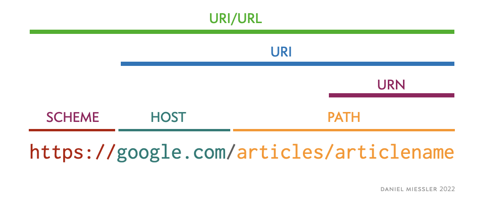

# How to navigate Unofficial Blooket API Documentation

To make it easier to understand how we have laid out the documentation we have a few examples below on the terminology we use.
Let's take an example of a request and breakdown how we will refer to it.

We will always ignore the scheme as it is always HTTPS.

The host/authority for each request may be differerent but for reference unless stated otherwise we'll be referring to `APIHost` in the variables table below.

The path will be given in each request and is in [HTTP Sematics format](https://www.rfc-editor.org/rfc/rfc9110.html), though you don't have to fully understand it as long as you use common sense.

## Commonly used variables

Below are a list of commonly used variables within the documentation.

| Variable   | Description                                                                        | Value (if applicable)                                                            |
| ---------- | ---------------------------------------------------------------------------------- | -------------------------------------------------------------------------------- |
| APIHost    | The host that will be used for a majority of requests made to Blooket              | `https://api.blooket.com/api`                                                    |
| IDHost     | Host used for certain requests by the API, those requests will have a note on them | `https://id.blooket.com`                                                         |
| AuthCookie | The cookie that we will be using to authenticate our requests                      | Get your auth cookie from [this](./auth/CheckAuth.md) request.                   |
| BuildID    | The build ID of the Blooket API                                                    | Can be grabbed from the [getBuildConfig](../snippets/getBuildConfig.js) snippet. |
